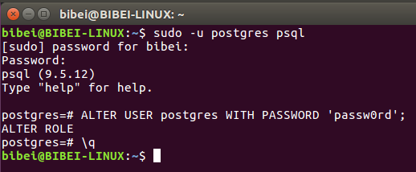
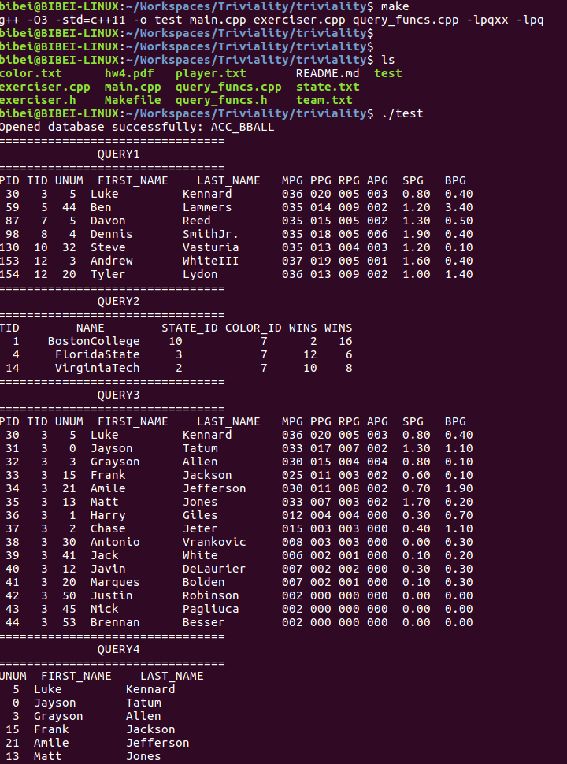

# Configure
  Open a terminal on the Ubuntu, then type:
	```sh
		sudo apt-get install libpqxx-dev postgresql
	```
  Change the password of user 'postgres', type:
	```sh
	sudo -u postgres psql
	postgres=# ALTER USER postgres WITH PASSWORD 'passw0rd';
	postgres=# \q
	```
  The result as follow:
  
  
  Now, we has changed the password, then we need to change something with its configure file.
	```sh
	sudo vim /etc/postgresql/9.5/main/pg_hba.conf
	```
  change the line 85, as follow.
	

  Now, we need to restart the service.
	```sh
	sudo service postgresql restart
	```

  Finally, we start to create the database, it is needed you type the password 'passw0rd'.
	```sh
	sudo -u postgres createdb -O postgres ACC_BBALL
	```

# Compile and Run
  Open a terminal, then type:
	```sh
		cd /path/to/code_dir
		make
		./test
	```
  The results as follow:
  
  
  