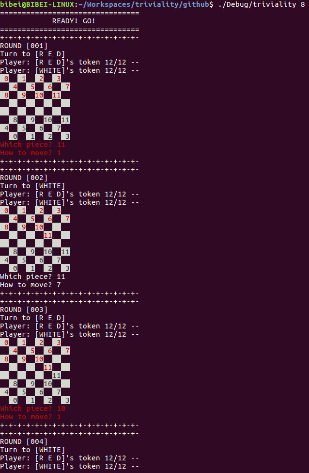
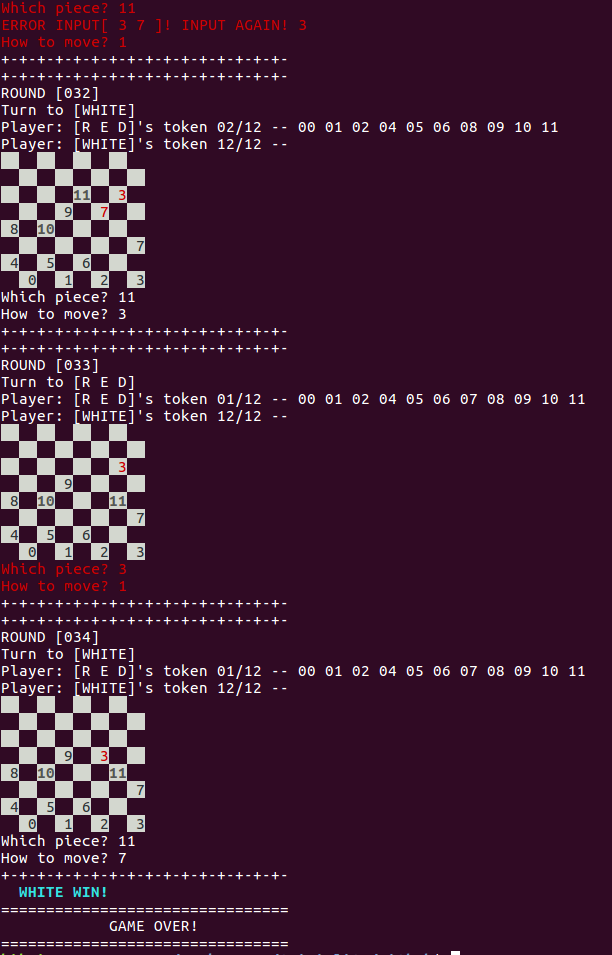

# Compile and run
 Open a termial, then type:
 ```sh
 	cd /path/to/code_dir
 	make
 	./checker 8
 ```

# Play
 按照屏幕输出提示，每次都是红色Player先走。无论哪个Player下棋，都是分两步进行：
 1. 选择本方的棋子，以编号作为输入，例如0，1，2等，若错误输入，将会要求重新输入。输入之后，以回车作为输入结束；
 2. 选择要走的方向，使用7、9、3、1表示该棋子的四个对角方向；若要连续跳棋，则输入7 9 3等，以空格作为分割符，仍然以回车作为输入结束；

# 说明
 棋子：棋子使用颜色进行标注，分为红色棋子和白色棋子，分别使用红色和白色显示，每个棋子使用0~N的整形数据进行编号；
 王棋：王棋可以倒退，使用加粗的字体表示；
 方向：使用7、9、3、1四个数字表示四个不同的方向，分别意义如下：7 -- 左上； 9 -- 右上； 3 -- 右下； 1 -- 左下；

# 附件
 程序开始时截图：
 <div align=center>
	
 </div>

 程序结束时截图：
 <div align=center>
 	
 </div>